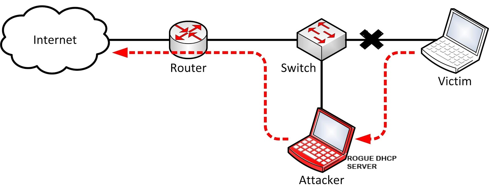

# DHCP Spoofing Lab

In this lab we will use [Kali](https://www.kali.org), [Ubuntu](https://www.ubuntu.com) & [Scapy](https://scapy.net/). 

## Lab Overview
The Dynamic Host Configuration Protocol (DHCP) is a network management protocol used on UDP/IP networks whereby a DHCP server dynamically assigns an IP address and other network configuration parameters to each device on a network so they can communicate with other IP networks.
DHCP spoofing is a method of attack of a computer on a local network on another computer on the same network that aims to control the network settings of the computer being attacked by phishing to a DHCP server running on the same network.

- On a network where an active DHCP server is installed, workstations can mount without network settings and send a DHCP message in Broadcast.

- The DHCP server identifies the redirect and answers the requesting computer in a message containing the desired network settings, which usually contain the IP address assigned to the computer, the default gateway address, and the DNS server address.

- In a DHCP attack spoofing the computer the attacker listens to the network and waits for DHCP messages sent on the Broadcast so that it can receive them as well.

- Once a message is identified, it sends a counterfeit response message that competes with the server's response and if the affected computer receives its first message, it will adopt the network settings set in it.

- In fact, the attacker scams the computer and causes it to think that it is the DHCP server on the local network, hence the name of the attack.

## Lab Environment
If [VirtualBox](https://www.virtualbox.org) is not installed on your computer, install it now. 

Path: `cd "C:\Program Files\Oracle\VirtualBox\"` 

- Victim VM: 
  `VBoxManage startvm "Ubuntu"` 
- Attacker VM: 
  `VBoxManage startvm "Kali"` 

## Lab Tasks
### Task 1: DHCP Spoofing

### Task 2: Spoofing DHCP Packets
#### Task 2.1: Run `spoofing_script`.
**Describe what do you see on Sniff's screen?**

#### Task 2.2: Improve `spoofing_script`.

## Finish up

### Stop containers

## Submission
You need to submit a detailed lab report, with screenshots, to describe what you have done and what you have observed. 
You also need to provide explanation to the observations that are interesting or surprising. 
Please also list the important code snippets followed by explanation. 
Simply attaching code without any explanation will not receive credits.
